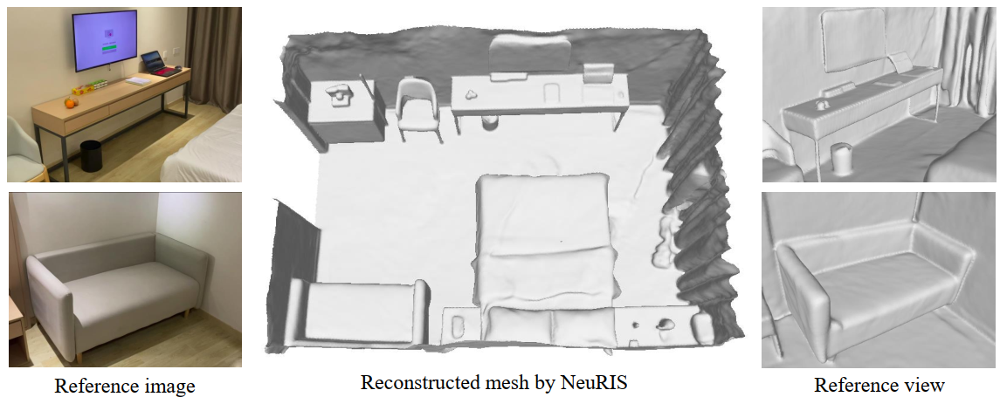

# NeuRIS
We propose a new method, dubbed NeuRIS, for high quality reconstruction of indoor scenes. 



## [Project page](https://jiepengwang.github.io/NeuRIS/) |  [Paper](https://arxiv.org/abs/2206.13597) | [Data](https://connecthkuhk-my.sharepoint.com/:f:/g/personal/jiepeng_connect_hku_hk/Er7bpbBAxMBBnZfDvdvrO1kBu2tkTpnMw9XXfeuQzkwOlA?e=Yf0Bbj)


## Usage

#### Data preparation
Scene data used in NeuRIS can be downloaded from [here](https://connecthkuhk-my.sharepoint.com/:f:/g/personal/jiepeng_connect_hku_hk/ElKcK1sus9pLnARZ_e9l-IcBS6cE-6w8xt34bMsvMAiuIQ?e=0z1eka) and extract the scene data into folder `dataset/indoor`. And the scene data used in [ManhattanSDF](https://github.com/zju3dv/manhattan_sdf) are also included for convenient comparisons.
The data is organized as follows:
```
<scene_name>
|-- cameras_sphere.npz   # camera parameters
|-- image
    |-- 0000.png        # target image for each view
    |-- 0001.png
    ...
|-- depth
    |-- 0000.png        # target depth for each view
    |-- 0001.png
    ...
|-- pose
    |-- 0000.txt        # camera pose for each view
    |-- 0001.txt
    ...
|-- pred_normal
    |-- 0000.npz        # predicted normal for each view
    |-- 0001.npz
    ...
|-- xxx.ply		# GT mesh or point cloud from MVS
|-- trans_n2w.txt       # transformation matrix from normalized coordinates to world coordinates
```

Refer to the [file](https://github.com/jiepengwang/NeuRIS/blob/main/preprocess/README.md) for more details about data preparation of ScanNet or private data.


### Setup
```
conda create -n neuris python=3.8
conda activate neuris
conda install pytorch=1.9.0 torchvision torchaudio cudatoolkit=10.2 -c pytorch
pip install -r requirements.txt
```

### Training

```
python ./exp_runner.py --mode train --conf ./confs/neuris.conf --gpu 0 --scene_name scene0625_00
```

### Mesh extraction
```
python exp_runner.py --mode validate_mesh --conf <config_file> --is_continue
```

### Evaluation
```
python ./exp_evaluation.py --mode eval_3D_mesh_metrics
```

## Citation
Cite as below if you find this repository is helpful to your project:

```
@article{wang2022neuris,
      	title={NeuRIS: Neural Reconstruction of Indoor Scenes Using Normal Priors}, 
      	author={Wang, Jiepeng and Wang, Peng and Long, Xiaoxiao and Theobalt, Christian and Komura, Taku and Liu, Lingjie and Wang, Wenping},
	publisher = {arXiv},
      	year={2022}
}
```